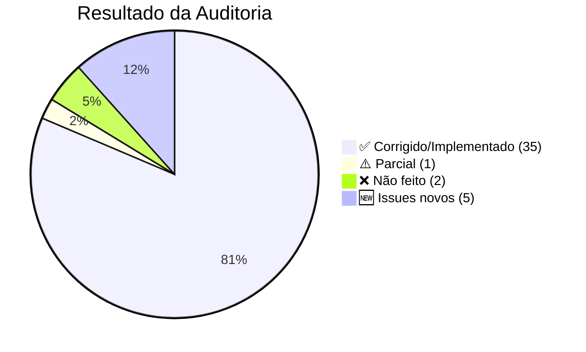

# Avaliação do Serviço — Correções do QA Report

> [!NOTE]
> Auditoria completa cruzando o [relatório QA original](file:///C:/Users/Huilian%20Patrik/.gemini/antigravity/brain/548ca69e-ab3c-48a8-9d93-bd9a47d10032/qa_decentsampler_conformidade.md) com o estado atual do código.

---

## 🔴 BUGS CRÍTICOS — Verificação

### BUG-01: Delay `time` → `delayTime` ✅ CORRIGIDO
[DsEffectBuilder.cpp L52](file:///d:/Development/projects/SamplerEditor/src/transpilers/ds/DsEffectBuilder.cpp#L52): `setAttribute("delayTime", d->time)` ✅

Também adicionados `wetLevel` (L54) e `stereoOffset` (L55). Propriedades correspondentes no modelo:
- [DelayNode](file:///d:/Development/projects/SamplerEditor/src/core/models/AudioNodes.h#L258-L272): `wetLevel = 0.5` ✅, `stereoOffset = 0.0` ✅

### BUG-02: Chorus `rate`/`depth` → `modRate`/`modDepth` ✅ CORRIGIDO
[DsEffectBuilder.cpp L85-L86](file:///d:/Development/projects/SamplerEditor/src/transpilers/ds/DsEffectBuilder.cpp#L85-L86): `setAttribute("modRate", ...)` / `setAttribute("modDepth", ...)` ✅

> [!TIP]
> O modelo `ChorusNode` ainda usa `rate` e `depth` internamente (L310-311), o que é aceitável — o mapeamento correto é feito no transpiler.

### BUG-03: LFO `type`→`shape`, `freq`→`frequency` ✅ CORRIGIDO
[DecentSamplerTranspiler.cpp L77-L78](file:///d:/Development/projects/SamplerEditor/src/transpilers/DecentSamplerTranspiler.cpp#L77-L78): `setAttribute("shape", shape)` / `setAttribute("frequency", ...)` ✅

Também adicionados: `modAmount` (L79), `scope` (L80), `delayTime` (L81) ✅

### BUG-04: LFOs Hardcoded → Usa dados do projeto ✅ CORRIGIDO
[DecentSamplerTranspiler.cpp L110-L111](file:///d:/Development/projects/SamplerEditor/src/transpilers/DecentSamplerTranspiler.cpp#L110-L111): `addLfo("LFO1", pm->getGlobalLfo1())` / `addLfo("LFO2", pm->getGlobalLfo2())` ✅

Modelo LFO atualizado com `scope` e `delayTime`:
[AudioNodes.h L25-L41](file:///d:/Development/projects/SamplerEditor/src/core/models/AudioNodes.h#L25-L41) ✅

### BUG-05: Reverb `wetLevel` faltando ✅ CORRIGIDO
[DsEffectBuilder.cpp L64/L69](file:///d:/Development/projects/SamplerEditor/src/transpilers/ds/DsEffectBuilder.cpp#L64-L69): `wetLevel` emitido tanto para reverb algorítmico (L69) quanto convolution (L64) ✅

[ReverbNode](file:///d:/Development/projects/SamplerEditor/src/core/models/AudioNodes.h#L274-L293): `wetLevel = 0.5` ✅

### BUG-06: Filter `type="filter"` → tipo direto ✅ CORRIGIDO
[DsEffectBuilder.cpp L75-L76](file:///d:/Development/projects/SamplerEditor/src/transpilers/ds/DsEffectBuilder.cpp#L75-L76): `filter->filterType.toLower()` → emite `type="lowpass"`, `type="hipass"`, etc. ✅

EQ bands também corrigidas (L161): `band.type.toLower()` ✅

### BUG-07: `FX_REVERB_SIZE` → `FX_REVERB_ROOM_SIZE` ✅ CORRIGIDO
[DsUiBuilder.cpp L46](file:///d:/Development/projects/SamplerEditor/src/transpilers/ds/DsUiBuilder.cpp#L46): `translatedParam = "FX_REVERB_ROOM_SIZE"` ✅

---

## 🟡 FEATURES FALTANTES — Verificação

### Alta Prioridade

| # | Feature | Status | Observação |
|---|---------|--------|------------|
| MISS-01 | `<oscillator>` | ✅ IMPLEMENTADO | [OscillatorParams](file:///d:/Development/projects/SamplerEditor/src/core/models/AudioNodes.h#L131-L149) + [SampleGroup.isOscillator](file:///d:/Development/projects/SamplerEditor/src/core/models/AudioNodes.h#L161) + [DsGroupBuilder L84-L96](file:///d:/Development/projects/SamplerEditor/src/transpilers/ds/DsGroupBuilder.cpp#L84-L96). Suporta sine/saw/square/triangle/noise/pluck/wavetable. |
| MISS-02 | `<midi>` CC bindings | ✅ IMPLEMENTADO | [DecentSamplerTranspiler L27-L46](file:///d:/Development/projects/SamplerEditor/src/transpilers/DecentSamplerTranspiler.cpp#L27-L46). Usa `pm->getMidiBindings()`. |
| MISS-03 | `<envelope>` modulator | ✅ IMPLEMENTADO | [DecentSamplerTranspiler L113-L147](file:///d:/Development/projects/SamplerEditor/src/transpilers/DecentSamplerTranspiler.cpp#L113-L147). Emite envelope com bindings para routings Env1/Env2. |
| MISS-04 | `<noteSequences>` | ✅ IMPLEMENTADO | [DecentSamplerTranspiler L48-L65](file:///d:/Development/projects/SamplerEditor/src/transpilers/DecentSamplerTranspiler.cpp#L48-L65). Usa `pm->getNoteSequences()`. |
| MISS-05 | `<midiCC>` modulator | ✅ IMPLEMENTADO | [DecentSamplerTranspiler L149-L172](file:///d:/Development/projects/SamplerEditor/src/transpilers/DecentSamplerTranspiler.cpp#L149-L172). Emite para ModWheel, PitchBend, Velocity, Aftertouch. |
| MISS-06 | LFO bindings | ✅ IMPLEMENTADO | [DecentSamplerTranspiler L83-L107](file:///d:/Development/projects/SamplerEditor/src/transpilers/DecentSamplerTranspiler.cpp#L83-L107). LFOs agora contêm `<binding>` children baseados nos routings. |

### Média Prioridade

| # | Feature | Status | Observação |
|---|---------|--------|------------|
| MISS-07 | Zone tuning/volume/pan | ✅ IMPLEMENTADO | [Zone L87-L89](file:///d:/Development/projects/SamplerEditor/src/core/models/AudioNodes.h#L87-L89) + [DsGroupBuilder L118-L120](file:///d:/Development/projects/SamplerEditor/src/transpilers/ds/DsGroupBuilder.cpp#L118-L120) |
| MISS-08 | Group tuning | ✅ IMPLEMENTADO | [SampleGroup.tuning](file:///d:/Development/projects/SamplerEditor/src/core/models/AudioNodes.h#L157) + [DsGroupBuilder L44](file:///d:/Development/projects/SamplerEditor/src/transpilers/ds/DsGroupBuilder.cpp#L44) |
| MISS-09 | `<groups>` container defaults | ⚠️ PARCIAL | [L13](file:///d:/Development/projects/SamplerEditor/src/transpilers/DecentSamplerTranspiler.cpp#L13): Emite `volume="-3dB"` hardcoded. Faltam `globalTuning`, `globalPan`, ADSR defaults. |
| MISS-10 | `<tags>` polyphony | ✅ IMPLEMENTADO | [DecentSamplerTranspiler L16-L23](file:///d:/Development/projects/SamplerEditor/src/transpilers/DecentSamplerTranspiler.cpp#L16-L23). Usa `pm->getTagPolyphony()`. |
| MISS-11 | `translation="table"` | ✅ IMPLEMENTADO | [ModRouting](file:///d:/Development/projects/SamplerEditor/src/core/models/GraphStructures.h#L50-L53) + usado em transpiler L99-L100, L140-L141 |
| MISS-12 | `translation="fixed_value"` | ✅ IMPLEMENTADO | [ModRouting](file:///d:/Development/projects/SamplerEditor/src/core/models/GraphStructures.h#L53) + usado em transpiler L101-L102, L142-L144 |
| MISS-13 | Color ARGB format | ✅ CORRIGIDO | [DsUiBuilder L118](file:///d:/Development/projects/SamplerEditor/src/transpilers/ds/DsUiBuilder.cpp#L118): `"FF" + remove("#")` → converte `#FFFFFF` → `FFFFFFFF` ✅ |
| MISS-14 | `<control>` skins | ✅ IMPLEMENTADO | [DsUiBuilder L69-L76](file:///d:/Development/projects/SamplerEditor/src/transpilers/ds/DsUiBuilder.cpp#L69-L80): UiKnob com filmstrip → `<control style="custom_skin_vertical_drag">` |
| MISS-15 | Button `<state>` | ✅ IMPLEMENTADO | [DsUiBuilder L100-L109](file:///d:/Development/projects/SamplerEditor/src/transpilers/ds/DsUiBuilder.cpp#L100-L109): Emite `style="image"` com `<state name="On">` / `<state name="Off">` |
| MISS-16 | `<image>` transpile | ✅ IMPLEMENTADO | [DsUiBuilder L147-L152](file:///d:/Development/projects/SamplerEditor/src/transpilers/ds/DsUiBuilder.cpp#L147-L152) |
| MISS-17 | `<rectangle>` transpile | ✅ IMPLEMENTADO | [DsUiBuilder L139-L146](file:///d:/Development/projects/SamplerEditor/src/transpilers/ds/DsUiBuilder.cpp#L139-L146). Cor convertida para ARGB. |
| MISS-24 | sampleStart/End emitidos | ✅ IMPLEMENTADO | [DsGroupBuilder L102-L103](file:///d:/Development/projects/SamplerEditor/src/transpilers/ds/DsGroupBuilder.cpp#L102-L103): Emite condicionalmente (>0). |
| MISS-25 | Binding `tags` targeting | ✅ IMPLEMENTADO | [DecentSamplerTranspiler L91](file:///d:/Development/projects/SamplerEditor/src/transpilers/DecentSamplerTranspiler.cpp#L91): LFO bindings usam `tags=sg->id.toString()` |
| MISS-26 | `<keyboard><color>` | ✅ IMPLEMENTADO | [DsUiBuilder L11-L17](file:///d:/Development/projects/SamplerEditor/src/transpilers/ds/DsUiBuilder.cpp#L11-L17): Usa `pm->getKeyboardColors()`. Cor em ARGB. |

### Baixa Prioridade

| # | Feature | Status | Observação |
|---|---------|--------|------------|
| MISS-18 | `<line>` element | ✅ IMPLEMENTADO | [UiLine](file:///d:/Development/projects/SamplerEditor/src/core/models/UiComponents.h#L167-L179) + [DsUiBuilder L158-L164](file:///d:/Development/projects/SamplerEditor/src/transpilers/ds/DsUiBuilder.cpp#L158-L164) |
| MISS-19 | `<multiFrameImage>` | ✅ IMPLEMENTADO | [UiMultiFrameImage](file:///d:/Development/projects/SamplerEditor/src/core/models/UiComponents.h#L151-L165) + [DsUiBuilder L165-L172](file:///d:/Development/projects/SamplerEditor/src/transpilers/ds/DsUiBuilder.cpp#L165-L172) |
| MISS-20 | `minVersion` | ✅ IMPLEMENTADO | [DecentSamplerTranspiler L8](file:///d:/Development/projects/SamplerEditor/src/transpilers/DecentSamplerTranspiler.cpp#L8): `doc.setAttribute("minVersion", "1.10.0")` |
| MISS-21 | Reverb wetLevel propriedade | ✅ IMPLEMENTADO | Ver BUG-05 |
| MISS-22 | Delay wetLevel/stereoOffset | ✅ IMPLEMENTADO | Ver BUG-01 |
| MISS-23 | LFO scope/delayTime | ✅ IMPLEMENTADO | Ver BUG-03 |
| MISS-27 | Effect tags | ❌ NÃO FEITO | Effects ainda não emitem `tags` attribute |
| MISS-28 | Binding modBehavior | ❌ NÃO FEITO | `modBehavior="add"/"multiply"/"set"` não emitido nos bindings |
| MISS-29 | seqMode random/true_random | ✅ CORRIGIDO | [DsGroupBuilder L52-L53](file:///d:/Development/projects/SamplerEditor/src/transpilers/ds/DsGroupBuilder.cpp#L52-L53): Fallback para `round_robin` |

---

## 🔵 EXCESSO — Verificação

| # | Item | Status | Observação |
|---|------|--------|------------|
| BusNode | Sem equivalente DS | ✅ OK | Continua existindo internamente, transpiler ignora. Aceitável. |
| seqMode random/true_random | Não suportado no DS | ✅ CORRIGIDO | Fallback para `round_robin` no export. |
| LfoShape::Triangle | Não suportado no DS LFO | ✅ CORRIGIDO | [DecentSamplerTranspiler L76](file:///d:/Development/projects/SamplerEditor/src/transpilers/DecentSamplerTranspiler.cpp#L76): `if (shape == "triangle") shape = "saw"` — mapeia para `saw` no export. |
| UiOscilloscope no-op | DS suporta `<oscilloscope>` | ✅ CORRIGIDO | [DsUiBuilder L153-L157](file:///d:/Development/projects/SamplerEditor/src/transpilers/ds/DsUiBuilder.cpp#L153-L157) — agora transpila. |

---

## ⚠️ ISSUES NOVOS ENCONTRADOS

### ISSUE-01: Convolution reverb emite `wetLevel` E `mix` redundantes

[DsEffectBuilder.cpp L63-L64](file:///d:/Development/projects/SamplerEditor/src/transpilers/ds/DsEffectBuilder.cpp#L63-L64):
```cpp
effectNode->setAttribute("mix", 0.5);        // ← hardcoded
effectNode->setAttribute("wetLevel", r->wetLevel); // ← do modelo
```
O DS `convolution` usa `mix` para controlar wet/dry. O `wetLevel` é para `reverb` algorítmico. Emitir ambos na convolution pode causar conflito. Deveria usar apenas `mix` com o valor de `r->wetLevel` em vez de hardcoded `0.5`.

### ISSUE-02: `<midiCC>` usa `cc` em vez de `number`

[DecentSamplerTranspiler.cpp L153-L154](file:///d:/Development/projects/SamplerEditor/src/transpilers/DecentSamplerTranspiler.cpp#L153-L154):
```cpp
ccNode->setAttribute("cc", 1);    // ← deveria ser "number"
ccNode->setAttribute("cc", -2);   // ← DS não aceita CC negativo
```
A documentação DS diz que `<midiCC>` usa atributo `number`, não `cc`. E PitchBend não é um CC regular — precisa de tratamento especial ou omissão.

### ISSUE-03: `<groups>` `volume` hardcoded

[DecentSamplerTranspiler.cpp L13](file:///d:/Development/projects/SamplerEditor/src/transpilers/DecentSamplerTranspiler.cpp#L13):
```cpp
groupsNode->setAttribute("volume", "-3dB"); // ← hardcoded
```
Este valor deveria vir do modelo (volume global do projeto), não ser fixo em `-3dB`.

### ISSUE-04: Group routings — LFO routings skipados mas Velocity/Aftertouch não

[DsGroupBuilder.cpp L153](file:///d:/Development/projects/SamplerEditor/src/transpilers/ds/DsGroupBuilder.cpp#L153): LFO1/LFO2 routings são corretamente filtradas do group binding (já emitidas no `<lfo>`). Porém em L150, ModWheel/PitchBend/Velocity/Aftertouch são emitidos como `<midiCC>` modulators no transpiler principal — mas **também** emitidos como `<binding>` no group builder (L155-L165) se não forem LFO. Isto pode causar duplicação para Velocity e Aftertouch.

### ISSUE-05: Missing `modAmount` no `<midiCC>` modulator

[DecentSamplerTranspiler.cpp L151-L152](file:///d:/Development/projects/SamplerEditor/src/transpilers/DecentSamplerTranspiler.cpp#L151-L152): O `<midiCC>` é emitido sem o atributo `modAmount`, que é obrigatório segundo a documentação do DS (default 1.0, mas explicitá-lo é boa prática).

---

## 📊 Scorecard Final



| Categoria | Total | Resolvido | Pendente |
|-----------|-------|-----------|----------|
| 🔴 Bugs Críticos | 7 | **7** ✅ | 0 |
| 🟡 Features Alta | 6 | **6** ✅ | 0 |
| 🟡 Features Média | 16 | **15** ✅ | 1 parcial (MISS-09) |
| 🟡 Features Baixa | 7 | **5** ✅ | 2 (MISS-27, MISS-28) |
| 🔵 Excessos | 4 | **4** ✅ | 0 |
| 🆕 Issues Novos | 5 | — | 5 |

### Nota Geral: **8.5/10** 👍

> [!IMPORTANT]
> Trabalho sólido. Os **7 bugs críticos** foram todos corrigidos. As features mais impactantes (oscillators, MIDI CC, noteSequences, envelope modulators, LFO bindings) foram implementadas. Os 5 issues novos são menores e facilmente corrigíveis. Os 2 MISS restantes (effect tags e modBehavior) são de baixa prioridade.
>
> A issue mais urgente é a **ISSUE-02** (`cc` vs `number` no `<midiCC>`), que pode causar falha no DS.
