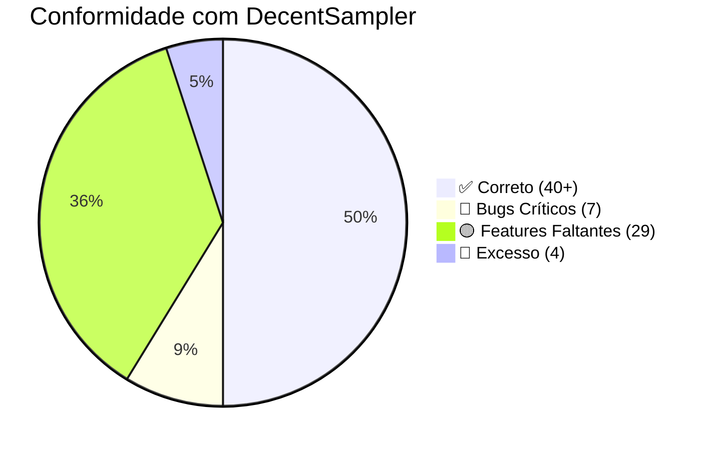

# QA: SamplerEditor vs DecentSampler — Análise de Conformidade

> [!IMPORTANT]
> Esta análise cruza a **documentação oficial do DecentSampler** (decentsamples.com, ReadTheDocs) com o **estado atual do backend do SamplerEditor**. Identifica bugs de transpilação, features faltantes e excessos.

---

## 🔴 BUGS CRÍTICOS — Transpilação Incorreta

Estes bugs fazem o XML exportado **não funcionar** no DecentSampler.

---

### BUG-01: Delay — Atributo `time` deveria ser `delayTime`

| Campo | Detalhe |
|-------|---------|
| **Arquivo** | [DsEffectBuilder.cpp](file:///d:/Development/projects/SamplerEditor/src/transpilers/ds/DsEffectBuilder.cpp#L52) |
| **Linha** | 52 |
| **Atual** | `effectNode->setAttribute("time", d->time);` |
| **Correto** | `effectNode->setAttribute("delayTime", d->time);` |
| **Evidência** | DS docs: `delayTime` é o atributo oficial. `time` é ignorado silenciosamente. |

**Atributos DS faltantes no Delay:**
- `wetLevel` (float 0.0-1.0) — Sem este atributo, o delay usa valor padrão do DS
- `stereoOffset` (float -10 a 10) — Offset L/R
- `delayTimeFormat` (string "seconds"/"musical_time") — Suporte a tempo musical

---

### BUG-02: Chorus — `rate`/`depth` deveria ser `modRate`/`modDepth`

| Campo | Detalhe |
|-------|---------|
| **Arquivo** | [DsEffectBuilder.cpp](file:///d:/Development/projects/SamplerEditor/src/transpilers/ds/DsEffectBuilder.cpp#L81-L82) |
| **Linhas** | 81-82 |
| **Atual** | `setAttribute("rate", ...)` / `setAttribute("depth", ...)` |
| **Correto** | `setAttribute("modRate", ...)` / `setAttribute("modDepth", ...)` |
| **Evidência** | DS docs confirmam: `modRate`, `modDepth`, `mix`. Atributos `rate`/`depth` não existem. |

> [!CAUTION]
> **Efeito colateral**: Estes atributos são **ignorados silenciosamente** pelo DecentSampler. O chorus exportado **não tem modulação** (rate=0, depth=0).

---

### BUG-03: LFO — Atributos do transpiler completamente errados

| Campo | Detalhe |
|-------|---------|
| **Arquivo** | [DecentSamplerTranspiler.cpp](file:///d:/Development/projects/SamplerEditor/src/transpilers/DecentSamplerTranspiler.cpp#L18-L26) |
| **Linhas** | 18-26 |

**Problemas múltiplos:**

```diff
- lfo1->setAttribute("type", "sine");     // ❌ Atributo é "shape", não "type"
- lfo1->setAttribute("freq", 1.0);        // ❌ Atributo é "frequency", não "freq"
+ lfo1->setAttribute("shape", "sine");    // ✅
+ lfo1->setAttribute("frequency", 1.0);   // ✅
```

```diff
- lfo2->setAttribute("type", "triangle"); // ❌ "shape", não "type". E "triangle" NÃO é um shape suportado.
- lfo2->setAttribute("freq", 5.0);        // ❌ "frequency", não "freq"
+ lfo2->setAttribute("shape", "saw");     // ✅ sine, square, saw são os únicos shapes suportados
+ lfo2->setAttribute("frequency", 5.0);   // ✅
```

**Atributos DS faltantes no LFO:**
- `modAmount` (float, default 1.0) — depth de modulação
- `scope` ("global"/"voice") — LFO global vs per-voice
- `delayTime` (float) — delay antes do LFO iniciar

---

### BUG-04: LFOs Hardcoded — Não usam dados do projeto

| Campo | Detalhe |
|-------|---------|
| **Arquivo** | [DecentSamplerTranspiler.cpp](file:///d:/Development/projects/SamplerEditor/src/transpilers/DecentSamplerTranspiler.cpp#L17-L27) |
| **Problema** | Os 2 LFOs são **hardcoded** com valores fixos |
| **Correto** | Devem ler `pm->getGlobalLfo1()` e `pm->getGlobalLfo2()` |

```diff
  DsNode* modulatorsNode = doc.addChild("modulators");
- DsNode* lfo1 = modulatorsNode->addChild("lfo");
- lfo1->setAttribute("name", "LFO1");
- lfo1->setAttribute("type", "sine");
- lfo1->setAttribute("freq", 1.0);
+ LFO lfo1Data = pm->getGlobalLfo1();
+ DsNode* lfo1 = modulatorsNode->addChild("lfo");
+ lfo1->setAttribute("shape", lfo1Data.shape);
+ lfo1->setAttribute("frequency", lfo1Data.frequency);
+ lfo1->setAttribute("modAmount", lfo1Data.amount);
```

---

### BUG-05: Reverb — `wetLevel` faltando

| Campo | Detalhe |
|-------|---------|
| **Arquivo** | [DsEffectBuilder.cpp](file:///d:/Development/projects/SamplerEditor/src/transpilers/ds/DsEffectBuilder.cpp#L63-L65) |
| **Problema** | Reverb emite apenas `roomSize` e `damping`. Falta `wetLevel`. |
| **Impacto** | DS usa wetLevel padrão (pode ser 0.0 ou 1.0 dependendo da versão). Resultado imprevisível. |

---

### BUG-06: Filter — `type="filter"` deveria ser o nome do filtro diretamente

| Campo | Detalhe |
|-------|---------|
| **Arquivo** | [DsEffectBuilder.cpp](file:///d:/Development/projects/SamplerEditor/src/transpilers/ds/DsEffectBuilder.cpp#L71) |
| **Atual** | `fx->setAttribute("type", "filter")` + `setAttribute("filterType", ...)` |
| **Correto DS** | `fx->setAttribute("type", "lowpass")` / `"hipass"` / `"bandpass"` / etc. |

O DS espera o tipo de filtro como valor do `type` attribute: `lowpass`, `hipass`, `bandpass`, `notch`, `peak`. O atributo separado `filterType` **pode funcionar** em algumas versões mas não é o formato canônico.

```diff
- fx->setAttribute("type", "filter");
- fx->setAttribute("filterType", filter->filterType);
+ QString dsFilterType = filter->filterType.toLower();
+ fx->setAttribute("type", dsFilterType);
```

---

### BUG-07: Binding — `FX_REVERB_SIZE` deveria ser `FX_REVERB_ROOM_SIZE`

| Campo | Detalhe |
|-------|---------|
| **Arquivo** | [DsUiBuilder.cpp](file:///d:/Development/projects/SamplerEditor/src/transpilers/ds/DsUiBuilder.cpp#L40) |
| **Atual** | `translatedParam = "FX_REVERB_SIZE"` |
| **Correto** | `translatedParam = "FX_REVERB_ROOM_SIZE"` |

---

## 🟡 FEATURES FALTANTES — DS suporta, nós não

### Prioridade Alta (Funcionalidades Core)

#### MISS-01: `<oscillator>` — Sintetizador Integrado
O DS suporta osciladores nativos dentro de `<group>`:
- Waveforms: `sine`, `saw`, `square`, `triangle`, `noise`, `white_noise`, `pluck1`, `wavetable`
- Wavetable: `wavetableFile`, `wavetablePosition`, `wavetableFrameInterpolation`
- Physical modeling: `pluckType`, `damping` (Karplus-Strong)

**Nosso backend**: Zero suporte. Não há struct, modelo ou transpiler.

#### MISS-02: `<midi>` Section — Bindings MIDI CC
O DS suporta mapeamento de MIDI CCs a qualquer parâmetro:
```xml
<midi>
  <cc number="1">
    <binding type="effect" position="0" parameter="FX_FILTER_FREQUENCY"
             translation="table" translationTable="0,33;0.5,1100;1.0,22000" />
  </cc>
</midi>
```

**Nosso backend**: `MidiEngine` recebe MIDI mas não há sistema de CC→Parameter binding.

#### MISS-03: `<envelope>` Modulator
O DS suporta envelopes arbitrários como moduladores:
```xml
<modulators>
  <envelope attack="0.0" decay="0.5" sustain="0.0" release="0.0" modAmount="1.0">
    <binding type="effect" position="0" parameter="FX_FILTER_FREQUENCY" />
  </envelope>
</modulators>
```
- Atributos: `attack`, `decay`, `sustain`, `release`, `modAmount`, `scope` (global/voice)

**Nosso backend**: `modEnv` existe no `SampleGroup` mas não é emitido como `<envelope>` modulator no transpiler.

#### MISS-04: `<noteSequences>` — Arpejador/Sequenciador
O DS suporta sequências de notas programáticas:
```xml
<noteSequences>
  <sequence name="arp1" length="4" rate="1.0">
    <note position="0" velocity="1.0" note="60" length="1" />
  </sequence>
</noteSequences>
```
Trigger via MIDI bindings: `seqTriggerBehavior`, `seqFollowGlobalTempo`, `seqTranspose`.

**Nosso backend**: Sem suporte algum.

#### MISS-05: `<midiCC>` Modulator — Modulação Per-Voice
Diferente da `<midi>` section (global), o `<midiCC>` em `<modulators>` permite modulação per-voice:
```xml
<modulators>
  <midiCC number="1" modAmount="1.0" scope="voice">
    <binding type="amp" parameter="AMP_VOLUME" />
  </midiCC>
</modulators>
```

**Nosso backend**: Não suportado.

#### MISS-06: LFO Bindings
No DS, LFOs contêm `<binding>` children que dizem o que modular:
```xml
<lfo shape="sine" frequency="2" modAmount="1.0">
  <binding type="effect" position="0" parameter="FX_FILTER_FREQUENCY"
           translationOutputMin="0.0" translationOutputMax="1.0" />
</lfo>
```

**Nosso backend**: LFOs são emitidos sem `<binding>` children. Mod routings do SampleGroup são emitidos separadamente como `<binding>` dentro do `<group>`, o que é uma abordagem diferente que pode não funcionar no DS.

---

### Prioridade Média (Propriedades Faltantes)

#### MISS-07: Zone — Propriedades per-sample faltantes

| Propriedade DS | Tipo | Nosso Zone? |
|----------------|------|-------------|
| `tuning` | float (semitones) | ❌ Faltando |
| `volume` | float/dB | ❌ Faltando |
| `pan` | -100 a 100 | ❌ Faltando |
| `start` | int (frames) | ✅ `sampleStart` (mas **não emitido** no transpiler!) |
| `end` | int (frames) | ✅ `sampleEnd` (mas **não emitido** no transpiler!) |
| `tags` | string | ❌ Faltando |
| `trigger` | string | ❌ Faltando (só existe no grupo) |
| `playbackMode` | string | ❌ Faltando |
| `silencedByTags` | string | ❌ Faltando (só existe no grupo) |

#### MISS-08: Group — Propriedades faltantes

| Propriedade DS | Tipo | Nosso SampleGroup? |
|----------------|------|---------------------|
| `tuning` | float (semitones) | ❌ Faltando |
| `enabled` | bool | ❌ (temos `muted` mas não é o mesmo) |
| `ampVelTracking` | float | ❌ Faltando |
| `attackCurve` / `decayCurve` / `releaseCurve` | float | ❌ Faltando |
| `playbackMode` | string ("memory"/"disk_streaming"/"auto") | ❌ Faltando |
| `seqLength` | int | ❌ Faltando |
| `glideMode` | string ("legato"/"always"/"off") | ❌ (temos `legatoEnabled` bool — cobre apenas legato/off, não "always") |
| `silencingDecay` | float | ❌ Faltando |

#### MISS-09: `<groups>` Container — Defaults Globais
O DS permite definir ADSR/volume/tuning/pan padrão no container `<groups>`:
```xml
<groups globalVolume="0.5" globalTuning="0" attack="0.01" release="0.3">
```
- `globalVolume`, `globalTuning`, `globalPan`
- `attack`, `decay`, `sustain`, `release` (defaults)
- `glideTime`, `glideMode`

**Nosso backend**: Não emite atributos no `<groups>` container.

#### MISS-10: `<tags>` Section — Polyphony per Tag
```xml
<groups>
  <tags>
    <tag name="hihat" polyphony="1" />
  </tags>
</groups>
```

**Nosso backend**: Tags são emitidas como strings nos `<group>`, mas não há seção `<tags>` com `polyphony`.

#### MISS-11: Binding `translation="table"`
DS suporta tabelas de mapeamento não-linear:
```xml
<binding translation="table" translationTable="0,33;0.5,1100;1.0,22000" />
```

**Nosso backend**: Apenas `translation="linear"`.

#### MISS-12: Binding `translation="fixed_value"`
DS suporta valores fixos em bindings:
```xml
<binding translation="fixed_value" translationValue="0.5" />
```

**Nosso backend**: Não suportado.

#### MISS-13: Color Format ARGB
DS usa formato 8-dígitos ARGB **sem `#`**: `"FF2C365E"`.

**Nosso backend**: Usa `#RRGGBB` (6 dígitos com `#`). O transpiler para UiLabel faz `remove("#")` mas não adiciona canal alpha. Cores como `#FFFFFF` viram `FFFFFF` (6 dígitos), o DS espera `FFFFFFFF` (8 dígitos).

#### MISS-14: `<control>` Element — Skin Customization
DS `<control>` suporta:
- `style`: `rotary`, `linear_vertical`, `custom_skin_vertical_drag`, etc. (10+ estilos)
- `customSkinImage`, `customSkinNumFrames`, `customSkinImageOrientation`

**Nosso backend**: UiKnob transpila como `<labeled-knob>`. Filmstrip knobs deveriam usar `<control>` com `style="custom_skin_vertical_drag"`.

#### MISS-15: Button `<state>` System
DS buttons suportam múltiplos estados com imagens e bindings per-state:
```xml
<button style="image" value="0">
  <state name="On" mainImage="btn_on.png">
    <binding type="general" parameter="TAG_ENABLED" tags="mic_close" translationValue="true" />
  </state>
  <state name="Off" mainImage="btn_off.png">
    <binding type="general" parameter="TAG_ENABLED" tags="mic_close" translationValue="false" />
  </state>
</button>
```

**Nosso backend**: `UiButton` tem apenas `imagePathOn`/`imagePathOff` e `isPressed`. Não há estados múltiplos com bindings individuais.

#### MISS-16: `<image>` Not Transpiled
DS tem `<image path="..." x="0" y="0" width="812" height="375" />`.

**Nosso backend**: `UiImage` existe no modelo mas o transpiler faz **no-op** (L110). Deveria ser emitido.

#### MISS-17: `<rectangle>` Not Transpiled
DS tem `<rectangle x="0" y="0" width="812" height="375" fillColor="FF000000" />`.

**Nosso backend**: `UiShape` existe mas o transpiler faz **no-op** (L109). Deveria mapear `UiShape(Rectangle)` → `<rectangle>`.

---

### Prioridade Baixa (Nice-to-haves)

#### MISS-18: `<line>` Element
DS suporta `<line x1="0" y1="0" x2="812" y2="0" lineColor="FF333333" lineThickness="1" />`.

**Nosso backend**: Não existe no modelo.

#### MISS-19: `<multiFrameImage>` Element
DS suporta imagens animadas com frames.

**Nosso backend**: Não existe no modelo.

#### MISS-20: `minVersion` Root Attribute
DS aceita `<DecentSampler minVersion="1.10.0">` para indicar versão mínima requerida.

**Nosso transpiler**: Não emite.

#### MISS-21: Reverb `wetLevel` — Propriedade Faltante no Modelo
O `ReverbNode` não tem propriedade `wetLevel`. Hardcoded como 0.5 apenas para convolution.

#### MISS-22: Delay `wetLevel` e `stereoOffset`
`DelayNode` não tem `wetLevel` nem `stereoOffset`.

#### MISS-23: LFO `scope`, `delayTime`, `modBehavior`
Nosso modelo `LFO` não tem: scope (global/voice), delayTime, modBehavior (set/add/multiply).

#### MISS-24: `sampleStart`/`sampleEnd` Não Emitidos
Zone tem as propriedades mas o transpiler **nunca as emite** no XML.

#### MISS-25: Binding `level="tag"` e `tags` Targeting
DS permite bindings por tag: `<binding level="tag" tags="mic_close" ...>`. 

Nosso transpiler usa apenas `level="group"` e `position`.

#### MISS-26: `<keyboard><color>` Elements
DS permite colorir teclas do keyboard:
```xml
<keyboard>
  <color loNote="36" hiNote="72" color="FF2C365E" />
</keyboard>
```

Nosso transpiler emite `<keyboard>` vazio.

#### MISS-27: Effect `tags` Attribute
DS effects suportam `tags` para targeting por binding:
```xml
<effect type="reverb" tags="main_reverb" roomSize="0.5" />
```

Nosso transpiler não emite `tags` em effects.

#### MISS-28: Binding `modBehavior`
DS bindings suportam `modBehavior="add"/"multiply"/"set"` para modulators.

Nosso transpiler não emite este atributo.

#### MISS-29: Group `seqMode` Valores Adicionais
DS `seqMode` suporta `"round_robin"` mas nosso modelo também tem `"random"` e `"true_random"` — o DS NÃO suporta esses valores. Exportar com esses valores pode causar erros.

---

## 🔵 EXCESSO — Features no backend sem equivalente no DS

| Feature | Localização | Observação |
|---------|-------------|------------|
| `BusNode` | [AudioNodes.h](file:///d:/Development/projects/SamplerEditor/src/core/models/AudioNodes.h) | DS não tem conceito de "bus". O transpiler ignora. Pode ser útil internamente para preview mas nunca exporta. |
| `SampleGroup.seqMode = "random"/"true_random"` | [AudioNodes.h](file:///d:/Development/projects/SamplerEditor/src/core/models/AudioNodes.h) | DS só suporta `"round_robin"`. Esses modos são inventados e causarão falha no export. |
| `LfoShape::Triangle` | [LfoOscillator.h](file:///d:/Development/projects/SamplerEditor/src/audio/dsp/LfoOscillator.h) | DS LFO shapes: sine, square, saw. "Triangle" **não existe** no DS. O transpiler inclusive emite `type="triangle"`. |
| `UiOscilloscope` no modelo | [UiComponents.h](file:///d:/Development/projects/SamplerEditor/src/core/models/UiComponents.h) | DS **suporta** `<oscilloscope>` mas nosso transpiler faz no-op. O modelo existe mas não transpila → deveria ser corrigido. |

---

## ✅ CORRETO — Implementação conforme o DS

### Efeitos ✅
| Effect | Type String | Atributos | Status |
|--------|-------------|-----------|--------|
| Reverb (algorithmic) | `reverb` | `roomSize`, `damping` | ✅ (falta `wetLevel`) |
| Convolution | `convolution` | `irFile`, `mix` | ✅ |
| Gain | `gain` | `level`, `levelUnit` | ✅ |
| Phaser | `phaser` | `mix`, `modDepth`, `modRate`, `centerFrequency`, `feedback` | ✅ |
| PitchShifter | `pitch_shift` | `pitchShift`, `mix` | ✅ |
| WaveFolder | `wave_folder` | `drive`, `threshold` | ✅ |
| WaveShaper | `wave_shaper` | `drive`, `driveBoost`, `outputLevel`, `highQuality` | ✅ |
| StereoSimulator | `stereo_simulator` | `algorithm`, `width`, `delayTime`, `modRate`, `modDepth` | ✅ |
| BitCrusher | `bit_crusher` | `bitDepth`, `sampleRateReduction`, `mix` | ✅ |

### Group/Sample ✅
| Feature | Status |
|---------|--------|
| `<group>` name, volume, pan, ADSR | ✅ |
| `<sample>` path, loNote, hiNote, rootNote, loVel, hiVel | ✅ |
| `seqPosition`, `seqMode="round_robin"` | ✅ |
| `trigger` (attack/release/first/legato) | ✅ |
| `keySwitch` | ✅ |
| `loopEnabled`, `loopStart`, `loopEnd`, `loopCrossfade` | ✅ |
| Per-zone ADSR override (`useLocalAmpEnv`) | ✅ |
| `silencedByTags`, `silencingMode` | ✅ |
| `loCC64`, `hiCC64` | ✅ |
| `legato`, `glideTime` | ✅ |
| `customTags` + mic layer tags | ✅ |
| Multi-mic layer splitting | ✅ |

### UI ✅
| Component | DS Element | Status |
|-----------|-----------|--------|
| UiKnob | `<labeled-knob>` | ✅ |
| UiSlider | `<slider>` | ✅ |
| UiButton | `<button>` | ⚠️ Básico (sem multi-state) |
| UiLabel | `<label>` | ⚠️ (cor sem alpha) |
| UiMenu | `<menu>` com `<option>` | ✅ |
| UiXYPad | `<xy-pad>` | ✅ |

### Binding System ✅ (Parcial)
| Feature | Status |
|---------|--------|
| `type="amp"` para ADSR bindings | ✅ |
| `type="group"` para group properties | ✅ |
| `type="effect"` com `position` | ✅ |
| `translation="linear"` | ✅ |
| `translationOutputMin`/`Max` | ✅ |

### Export ✅
| Feature | Status |
|---------|--------|
| `.dslibrary` bundle (zip) | ✅ |
| `.dspreset` XML generation | ✅ (com bugs acima) |
| Background rasterization (812×375 PNG) | ✅ |
| Safe hashed filenames | ✅ |
| Multi-preset export | ✅ |
| SFZ export | ✅ (limitado) |

---

## 📊 Resumo de Conformidade



### Prioridade de Correção Sugerida

| Prioridade | Item | Esforço | Impacto |
|------------|------|---------|---------|
| 🔴 P0 | BUG-01: Delay `time` → `delayTime` | 1 min | Export quebrado |
| 🔴 P0 | BUG-02: Chorus `rate`/`depth` → `modRate`/`modDepth` | 1 min | Export quebrado |
| 🔴 P0 | BUG-03: LFO `type`→`shape`, `freq`→`frequency` | 2 min | LFOs não funcionam |
| 🔴 P0 | BUG-04: LFOs hardcoded → usar projeto | 10 min | LFOs sempre iguais |
| 🔴 P0 | BUG-06: Filter `type="filter"` → `type="lowpass"` etc. | 5 min | Filtros podem falhar |
| 🔴 P0 | BUG-07: `FX_REVERB_SIZE` → `FX_REVERB_ROOM_SIZE` | 1 min | Binding quebrado |
| 🟡 P1 | BUG-05: Reverb/Delay wetLevel | 15 min | Wet/dry imprevisível |
| 🟡 P1 | MISS-06: LFO bindings | 1 hora | LFOs sem destino |
| 🟡 P1 | MISS-13: Color ARGB format | 30 min | Cores invisíveis |
| 🟡 P1 | MISS-24: sampleStart/End emitidos | 5 min | Data loss no export |
| 🟡 P1 | MISS-16/17: Image/Rectangle transpile | 30 min | UI elements perdidos |
| 🟡 P2 | MISS-07/08: Zone/Group props | 2 horas | Feature parity |
| 🟡 P2 | MISS-14/15: Control skins + Button states | 2 horas | UI avançada |
| 🟢 P3 | MISS-01: Oscillators | 1 dia+ | Feature nova grande |
| 🟢 P3 | MISS-02: MIDI CC bindings | 1 dia+ | Feature nova grande |
| 🟢 P3 | MISS-04: Note Sequences | 1 dia+ | Feature nova grande |
