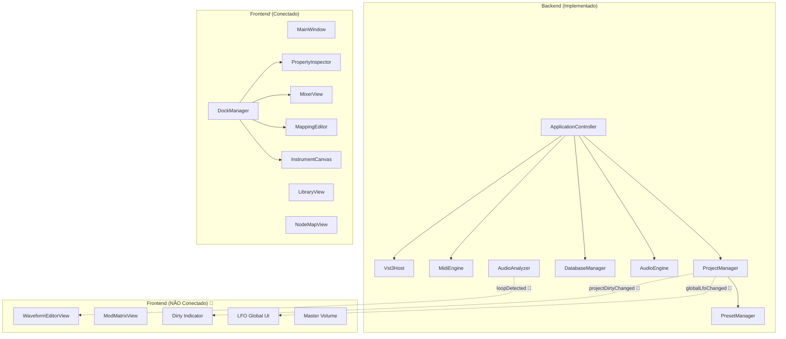
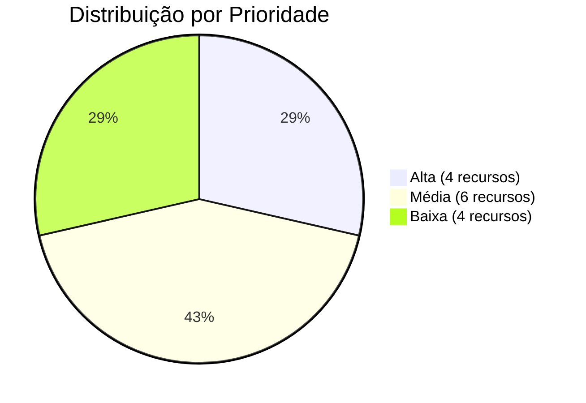

# Recursos de Backend Não Conectados ao Frontend

> [!NOTE]
> Este documento cataloga **14 recursos** do backend do SamplerEditor que estão **totalmente implementados** mas não possuem interface no frontend, ou cujo frontend não está compilado. Cada recurso representa uma funcionalidade pronta (ou quase pronta) para ser ativada na UI.

---

## Visão Geral da Arquitetura



---

## 🔴 Prioridade Alta

### 1. Sistema de LFO Global

| Aspecto | Detalhe |
|---------|---------|
| **Backend** | [ProjectManager.h](file:///d:/Development/projects/SamplerEditor/src/core/ProjectManager.h) |
| **Audio** | [AudioEngine.cpp](file:///d:/Development/projects/SamplerEditor/src/audio/AudioEngine.cpp) L137-142 |
| **Status** | ✅ Backend completo, ✅ Audio thread funcional, ❌ Sem UI |

**O que existe:**
- `ProjectManager::getGlobalLfo1()` / `setGlobalLfo1(const LFO&)` — Getter/setter para LFO 1
- `ProjectManager::getGlobalLfo2()` / `setGlobalLfo2(const LFO&)` — Getter/setter para LFO 2
- Sinal `globalLfoChanged` — emitido quando qualquer LFO é modificado
- `ApplicationController::updateLfos()` — Converte LFO para `AudioMessage::SetLFO` e envia ao AudioEngine
- `LfoOscillator` no AudioEngine — Processa LFO em tempo real com shapes: Sine, Triangle, Square, Saw
- `ModRouting` — O VoiceProcessor aplica LFO → Pitch/Volume/Cutoff via mod routing

**O que falta na UI:**
- Controles para `shape` (dropdown: Sine/Triangle/Square/Saw)
- Controles para `frequency` (knob/slider em Hz)
- Controles para `amount` (knob/slider 0.0 - 1.0)
- Duplicar para LFO1 e LFO2
- O `ModulatorsView` existente edita moduladores per-group (ADSR), mas **não toca nos LFOs globais**

**Próximos passos:**
1. Adicionar seção de LFO Global no `ModulatorsView` ou criar um `GlobalLfoView`
2. Conectar controles ao `ProjectManager::setGlobalLfo1/2()`
3. Usar `ModifyProjectLfoCommand` para undo support (recurso #3 abaixo)

---

### 2. Indicador de Projeto Não Salvo (Dirty State)

| Aspecto | Detalhe |
|---------|---------|
| **Backend** | [ProjectManager.h](file:///d:/Development/projects/SamplerEditor/src/core/ProjectManager.h) |
| **Status** | ✅ Backend completo, ❌ Sem indicação visual |

**O que existe:**
- `ProjectManager::isDirty()` — Retorna `true` se há modificações não salvas
- `ProjectManager::setDirty(bool)` — Define o estado
- Sinal `projectDirtyChanged(bool isDirty)` — Emitido a cada mudança de estado
- Auto-save timer de 2 segundos — Salva automaticamente quando dirty

**O que falta na UI:**
- Nenhum componente UI consome o sinal `projectDirtyChanged`
- Sem asterisco `*` no título da janela para indicar alterações não salvas
- Sem diálogo "Deseja salvar?" ao fechar com alterações pendentes

**Próximos passos:**
1. Em `MainWindow`, conectar `projectDirtyChanged` para atualizar o título:
   ```cpp
   connect(pm, &ProjectManager::projectDirtyChanged, this, [this](bool dirty) {
       setWindowTitle(pm->getCurrentProjectName() + (dirty ? " *" : "") + " — SamplerEditor");
   });
   ```
2. Sobrescrever `closeEvent()` para perguntar se deseja salvar

---

### 3. Matriz de Modulação (ModMatrixView)

| Aspecto | Detalhe |
|---------|---------|
| **Backend** | [AudioNodes.h](file:///d:/Development/projects/SamplerEditor/src/core/models/AudioNodes.h) — `SampleGroup::routings` |
| **UI (não compilada)** | [ModMatrixView.cpp](file:///d:/Development/projects/SamplerEditor/src/ui/inspector/ModMatrixView.cpp) |
| **Audio** | [VoiceProcessor.cpp](file:///d:/Development/projects/SamplerEditor/src/audio/dsp/VoiceProcessor.cpp) |
| **Status** | ✅ Backend + Audio completos, ⚠️ UI existe mas não compila |

**O que existe:**
- `ModRouting` struct: `source` (LFO1/LFO2/Env1/Env2/Velocity/ModWheel/PitchBend/Aftertouch), `destination` (Pitch/Volume/Pan/Cutoff/Resonance), `amount` (-1.0 a 1.0)
- `SampleGroup::routings` — `QVector<ModRouting>` armazena até 8 routings por grupo
- `VoiceProcessor::process()` — Aplica routings em tempo real (LFO → pitch, volume, cutoff, etc.)
- `ModMatrixView` — UI parcialmente implementada mas **NÃO está no CMakeLists.txt**
- `ApplicationController::updateRenderGraph()` — Converte routings do modelo para `AudioMessage::RenderRouting`

**O que falta:**
- Adicionar `src/ui/inspector/ModMatrixView.cpp` ao `APP_SOURCES` no CMakeLists.txt
- Conectar no `DockManager` (ou embutir no `GroupEditorView`)
- O ModMatrixView atualmente muta `SampleGroup::routings` diretamente — precisa de command undo

**Próximos passos:**
1. Adicionar ao CMakeLists.txt
2. Embutir no GroupEditorView ou PropertyInspector
3. Criar `ModifyRoutingsCommand` para undo support

---

### 4. Editor de Waveform com Detecção de Loop

| Aspecto | Detalhe |
|---------|---------|
| **Backend** | [AudioAnalyzer.h](file:///d:/Development/projects/SamplerEditor/src/audio/AudioAnalyzer.h) |
| **UI (não compilada)** | [WaveformEditorView.cpp](file:///d:/Development/projects/SamplerEditor/src/ui/waveform/WaveformEditorView.cpp) |
| **Status** | ✅ Backend completo, ⚠️ UI existe mas não compila |

**O que existe:**
- `AudioAnalyzer::findBestLoopAsync(filepath, startPct, endPct)` — Detecção automática de loop points via SAD (Sum of Absolute Differences)
- Sinais: `loopDetected(filepath, loopStartPct, loopEndPct)` / `loopDetectionFailed(filepath)`
- `WaveformEditorView` — UI com visualização de waveform + marcadores de loop draggáveis
- Integração com `WaveformCache` para carregamento assíncrono
- `Zone` model suporta: `loopEnabled`, `loopStart`, `loopEnd`, `loopCrossfade`

**O que falta:**
- Adicionar `src/ui/waveform/WaveformEditorView.cpp` ao `APP_SOURCES` no CMakeLists.txt
- Conectar no `SampleEditorContainer` ou como tab no editor de samples

**Próximos passos:**
1. Adicionar ao CMakeLists.txt
2. Embutir no `SampleEditorContainer` como aba
3. Botão "Auto-detect Loop" que chama `AudioAnalyzer::findBestLoopAsync()`

---

## 🟡 Prioridade Média

### 5. Commands de Conexão com Undo

| Aspecto | Detalhe |
|---------|---------|
| **Backend** | [ConnectionCommands.h](file:///d:/Development/projects/SamplerEditor/src/commands/ConnectionCommands.h) |
| **Status** | ✅ Commands existem, ❌ UI não os usa |

**O que existe:**
- `AddConnectionCommand(ProjectManager*, Connection)` — Adiciona conexão com undo
- `RemoveConnectionCommand(ProjectManager*, Connection)` — Remove conexão com undo

**Problema atual:**
- `NodeMapView` chama `pm->addConnection()` e `pm->removeConnection()` **diretamente**, sem passar pelo undo stack
- Resultado: Conexões criadas/removidas **não podem ser desfeitas** com Ctrl+Z

**Próximos passos:**
1. Em `NodeMapView`, substituir chamadas diretas por:
   ```cpp
   pm->getUndoStack()->push(new AddConnectionCommand(pm, conn));
   pm->getUndoStack()->push(new RemoveConnectionCommand(pm, conn));
   ```

---

### 6. Command de LFO com Undo

| Aspecto | Detalhe |
|---------|---------|
| **Backend** | [UiCommands.h](file:///d:/Development/projects/SamplerEditor/src/commands/UiCommands.h) |
| **Status** | ✅ Command existe, ❌ Nenhuma UI o utiliza |

**O que existe:**
- `ModifyProjectLfoCommand(ProjectManager*, int lfoIndex, LFO oldLfo, LFO newLfo)` — Mergeable (id=3)
- Suporta undo/redo completo para mudanças de LFO global

**Uso previsto:** Quando a UI de LFO Global (recurso #1) for implementada, usar este command para que mudanças de LFO sejam undo-able.

---

### 7. Commands de Zona Única

| Aspecto | Detalhe |
|---------|---------|
| **Backend** | [ZoneCommands.h](file:///d:/Development/projects/SamplerEditor/src/commands/ZoneCommands.h) |
| **Status** | ✅ Commands existem, ⚠️ UI usa apenas versão batch |

**O que existe:**
- `AddZoneCommand(ProjectManager*, QUuid sgId, Zone zone)` — Adiciona zona única
- `RemoveZoneCommand(ProjectManager*, QUuid sgId, int zoneIndex)` — Remove zona única

**Situação atual:**
- A UI sempre usa `AddMultipleZonesCommand` / `RemoveMultipleZonesCommand` (versão batch)
- As versões singulares poderiam ser usadas para operações mais granulares (drag-and-drop individual, right-click "Remove Zone")

---

### 8. Controle de Master Volume

| Aspecto | Detalhe |
|---------|---------|
| **Backend** | [AudioMessage.h](file:///d:/Development/projects/SamplerEditor/src/audio/AudioMessage.h) — `AudioCommandType::SetMasterVolume` |
| **Audio** | [AudioEngine.cpp](file:///d:/Development/projects/SamplerEditor/src/audio/AudioEngine.cpp) L135-136 |
| **Status** | ✅ Backend + Audio completos, ❌ Sem UI |

**O que existe:**
- `AudioCommandType::SetMasterVolume` — Tipo de comando definido
- `AudioEngine::m_masterVolume` — `atomic<float>` usado no processamento de áudio
- `AudioEngine::processAudio()` L135-136 — Processa o comando e aplica volume master
- `AudioEngine::processAudio()` L170-171 — `dryL[frame] = mixL * masterVol;`

**O que falta na UI:**
- Fader de Master Volume no MixerView ou na MainWindow
- Envio de `AudioMessage{SetMasterVolume, value}` via `AudioEngine::pushCommand()`

**Próximos passos:**
1. Adicionar fader no `MixerView` ou `MixerChannelStrip` (canal "Master")
2. Conectar ao `ApplicationController` ou diretamente ao `AudioEngine::pushCommand()`

---

### 9. Feedback Visual de Conexão Rejeitada

| Aspecto | Detalhe |
|---------|---------|
| **Backend** | [ProjectManager.cpp](file:///d:/Development/projects/SamplerEditor/src/core/ProjectManager.cpp) — `canConnect()` |
| **Status** | ✅ Validação completa, ❌ Sem feedback visual |

**O que existe:**
- `ProjectManager::canConnect(Connection)` — Validação completa:
  - Rejeita self-connections
  - Rejeita duplicatas
  - Valida tipos de porta (Audio↔Audio, etc.)
  - **DFS anti-ciclo** — Detecta loops no grafo de áudio
- Chamado internamente por `addConnection()`

**O que falta:**
- O `NodeGraphView` não dá feedback quando uma conexão é rejeitada
- O usuário arrasta um cabo, solta, e nada acontece — sem mensagem de erro

**Próximos passos:**
1. Chamar `pm->canConnect()` antes de adicionar e mostrar tooltip/shake animation se falhar
2. Colorir portas inválidas em vermelho durante drag

---

### 10. ModSources e ModDest Adicionais

| Aspecto | Detalhe |
|---------|---------|
| **Backend** | [AudioMessage.h](file:///d:/Development/projects/SamplerEditor/src/audio/AudioMessage.h) |
| **Audio** | [VoiceProcessor.cpp](file:///d:/Development/projects/SamplerEditor/src/audio/dsp/VoiceProcessor.cpp) |
| **Status** | ✅ Backend + Audio parcialmente implementados, ❌ Sem UI de configuração |

**O que existe (definido mas sem UI):**

| ModSource | Status Audio |
|-----------|-------------|
| `LFO1` | ✅ Processado |
| `LFO2` | ✅ Processado |
| `Env1` | ⚠️ Definido, processamento parcial |
| `Env2` | ⚠️ Definido, processamento parcial |
| `Velocity` | ✅ Processado |
| `ModWheel` | ⚠️ Definido, depende de MIDI CC |
| `PitchBend` | ⚠️ Definido, depende de MIDI CC |
| `Aftertouch` | ⚠️ Definido, depende de MIDI CC |

| ModDest | Status Audio |
|---------|-------------|
| `Pitch` | ✅ Processado |
| `Volume` | ✅ Processado |
| `Cutoff` | ✅ Processado |
| `Pan` | ⚠️ Definido, processamento a implementar |
| `Resonance` | ⚠️ Definido, processamento a implementar |

**O que falta:** Dropdowns no ModMatrixView (recurso #3) precisam listar TODAS estas opções, não apenas LFO1/LFO2 e Pitch/Volume.

---

## 🟢 Prioridade Baixa

### 11. DatabaseManager — Operações Não Expostas

| Método | Descrição | Uso Potencial |
|--------|-----------|---------------|
| `updateProject(ProjectRecord)` | Atualiza nome/thumbnail diretamente | Renomear projeto na Library |
| `getDatabasePath()` | Retorna path do SQLite | Janela "Sobre" / diagnóstico |
| `updateProjectModifiedAt(int)` | Atualiza timestamp | Usado internamente, mas poderia alimentar UI de "último acesso" |

---

### 12. Vst3Host::getParameter()

| Aspecto | Detalhe |
|---------|---------|
| **Backend** | [Vst3Host.cpp](file:///d:/Development/projects/SamplerEditor/src/audio/Vst3Host.cpp) L192-197 |
| **Status** | ✅ Implementado, ❌ Não utilizado |

**O que existe:**
- `float getParameter(int paramId) const` — Lê valor normalizado de parâmetros VST3

**Uso potencial:**
- Exibir valores reais dos parâmetros de efeitos VST3 na UI
- Sincronizar knobs da UI com o estado interno do plugin

---

### 13. AssetManagerView — ProjectManager Não Utilizado

| Aspecto | Detalhe |
|---------|---------|
| **UI** | [AssetManagerView.cpp](file:///d:/Development/projects/SamplerEditor/src/ui/assets/AssetManagerView.cpp) |
| **Status** | ⚠️ PM aceito no construtor mas nunca usado |

**Situação:**
- O `AssetManagerView` recebe `ProjectManager*` no construtor mas usa apenas `QFileSystemModel` para browsing
- O PM poderia ser usado para:
  - Mostrar assets referenciados pelo projeto (samples, imagens, filmstrips)
  - Detectar assets órfãos (referenciados mas não encontrados)
  - Drag-and-drop de assets para zonas/components

---

### 14. AudioEngine::loadSample / unloadSample — API Stub

| Aspecto | Detalhe |
|---------|---------|
| **Backend** | [AudioEngine.cpp](file:///d:/Development/projects/SamplerEditor/src/audio/AudioEngine.cpp) L46-53 |
| **Status** | ⚠️ No-ops — substituído por disk streaming |

**Situação:**
- `loadSample()` retorna `true` mas não faz nada — comentário: "No-op. Disk streaming handles this automatically."
- `unloadSample()` — vazio
- O miniaudio resource manager faz disk streaming automaticamente
- Estes métodos são vestígios de uma arquitetura anterior de pré-carregamento na RAM

**Recomendação:** Estes métodos podem ser removidos no futuro quando todo o código chamador for atualizado. Atualmente `ApplicationController::playNote()` ainda chama `loadSample()` como "safety net" antes de cada nota.

---

## Resumo de Impacto



| Prioridade | Recurso | Esforço Estimado |
|------------|---------|------------------|
| 🔴 Alta | LFO Global UI | 2-3 horas |
| 🔴 Alta | Dirty Indicator | 30 min |
| 🔴 Alta | ModMatrixView (ativar) | 1-2 horas |
| 🔴 Alta | WaveformEditor (ativar) | 1-2 horas |
| 🟡 Média | Connection Undo | 30 min |
| 🟡 Média | LFO Undo Command | 15 min (com LFO UI) |
| 🟡 Média | Zone Commands singulares | 30 min |
| 🟡 Média | Master Volume UI | 1 hora |
| 🟡 Média | Connection Feedback Visual | 1-2 horas |
| 🟡 Média | ModSources/Dest extras | 2 horas |
| 🟢 Baixa | DB Operations expostas | 30 min |
| 🟢 Baixa | Vst3Host::getParameter | 1 hora |
| 🟢 Baixa | AssetManager + PM | 2 horas |
| 🟢 Baixa | loadSample/unloadSample stubs | 15 min |
